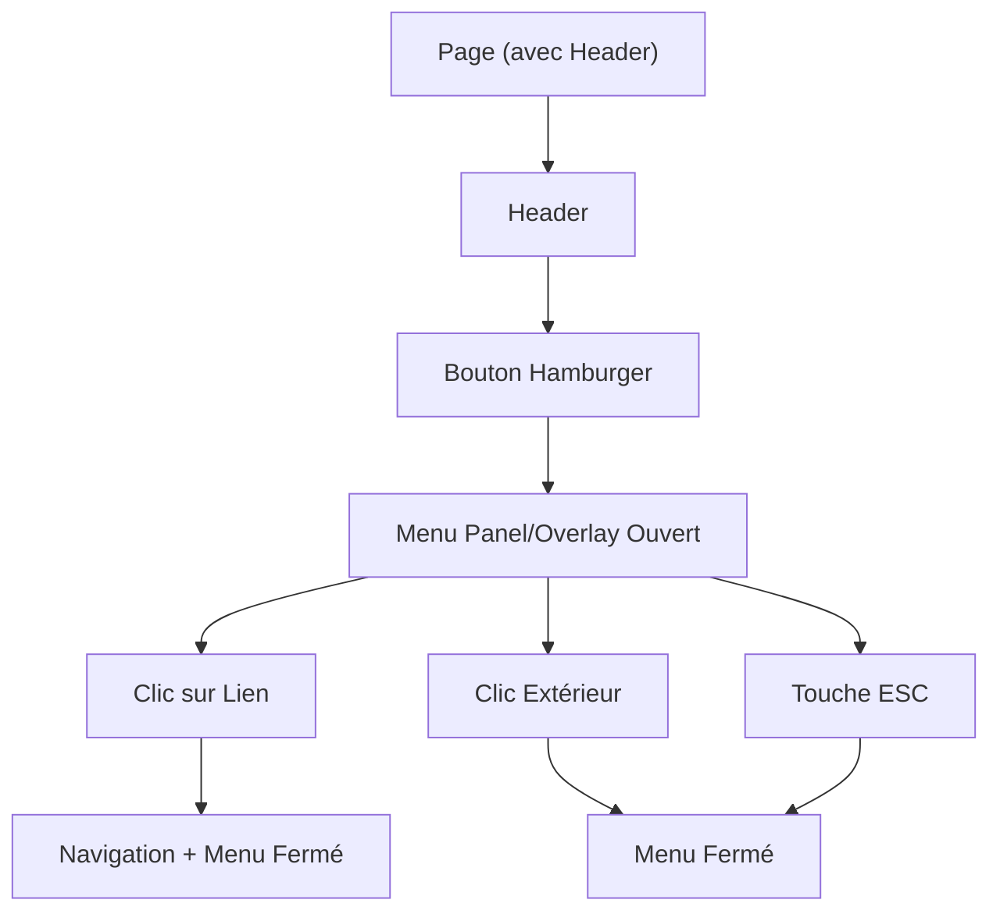

## 1. Product Overview
Ajouter un hamburger menu responsive dans le header, au style minimaliste “luxe discret”.
Objectif : navigation claire sur mobile/tablette, tout en restant accessible (clavier/ARIA) et robuste (fermeture clic extérieur / ESC).

## 2. Core Features

### 2.1 User Roles
Aucune distinction de rôles : la navigation est disponible pour tous les visiteurs.

### 2.2 Feature Module
1. **Header & Navigation** : bouton hamburger, ouverture/fermeture du menu, liens de navigation.

### 2.3 Page Details
| Page Name | Module Name | Feature description |
|-----------|-------------|---------------------|
| Header (global) | Bouton hamburger | Ouvrir/fermer le menu via clic/tap; afficher un état visuel (ouvert/fermé). |
| Header (global) | Menu overlay/panel | Afficher la navigation en mode mobile; empêcher les clics derrière (overlay) et indiquer clairement la zone de menu. |
| Header (global) | Accessibilité (ARIA + clavier) | Exposer `aria-expanded`, `aria-controls`, libellé accessible; permettre navigation clavier (Tab), fermer au `Escape`, gérer le focus (focus sur le panel à l’ouverture, retour au bouton à la fermeture). |
| Header (global) | Fermeture robuste | Fermer au clic extérieur (hors panel), au clic sur un lien de menu, et au `Escape`. |
| Header (global) | Responsive & style | Adapter l’affichage : liens inline sur desktop, hamburger + panel sur mobile; style minimaliste (typographie, espacements, couleurs sobres). |

## 3. Core Process
- Parcours visiteur (mobile) : tu arrives sur une page → tu vois le bouton hamburger → tu l’actives (clic/Entrée/Espace) → le panel de menu s’ouvre et le focus est géré → tu choisis un lien (fermeture + navigation) ou tu fermes via ESC / clic extérieur.
- Parcours visiteur (desktop) : tu vois les liens de navigation directement dans le header (hamburger optionnellement masqué) → tu navigues normalement.

