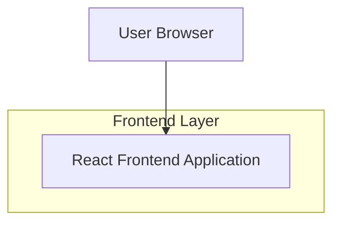

## 1.Architecture design

## 2.Technology Description
- Frontend: React@18 (components) + CSS (ou tailwindcss si déjà en place)
- Backend: None

## 3.Route definitions
| Route | Purpose |
|-------|---------|
| * | Toutes les routes affichent le header global avec navigation responsive |

## 6.Data model(if applicable)
Non applicable (aucune donnée persistée requise).

### Notes d’implémentation (accessibilité & comportement)
- Gérer l’état `isMenuOpen` côté composant Header.
- ARIA :
  - Bouton : `aria-expanded={isMenuOpen}`, `aria-controls="mobile-nav"`, `aria-label="Ouvrir le menu"` (ou texte visible + sr-only).
  - Panel : `id="mobile-nav"`, rôle pertinent (ex. `nav`), titre/label (ex. `aria-label="Navigation principale"`).
- Clavier :
  - Fermer au `Escape` (listener quand menu ouvert).
  - Gestion du focus : à l’ouverture, focus sur le panel ou le premier lien; à la fermeture, retour focus sur le bouton.
  - Tab : ne pas “perdre” le focus (recommandé : piège de focus simple tant que le panel est ouvert si overlay modal).
- Clic extérieur :
  - Overlay plein écran cliquable (clic overlay ferme, clic panel ne ferme pas via `stopPropagation`).
  - Alternative : listener `pointerdown` sur `document` + test `ref.contains(target)`.
- Scroll :
  - Optionnel mais recommandé : bloquer le scroll du body quand le menu est ouvert (éviter le “scroll derrière l’overlay”).
- Responsive :
  - Breakpoint : afficher liens inline ≥ desktop, sinon hamburger + panel.
- Qualité :
  - Prévoir tests manuels : tabbing, lecteur d’écran, iOS/Android, ouverture/fermeture rapide, rotation écran.