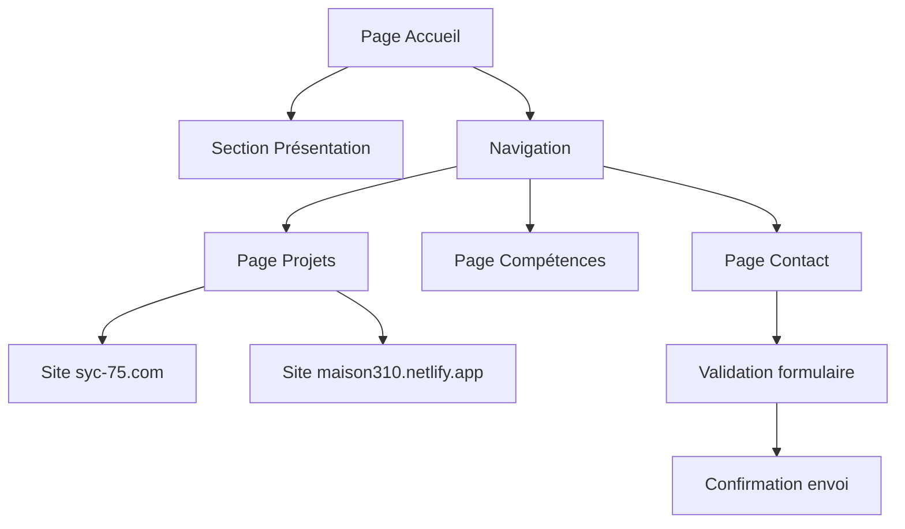

## 1. Vue d'ensemble du produit
Portfolio web professionnel pour Mikaël Lahlou, étudiant développeur web à HETIC Montreuil. Le site présente ses compétences, projets réalisés et permet aux recruteurs potentiels de le contacter. Objectif : démontrer son expertise technique et son sens du design moderne tout en restant épuré.

## 2. Fonctionnalités principales

### 2.1 Rôles utilisateurs
| Rôle | Méthode d'accès | Permissions |
|------|------------------|-------------|
| Visiteur | Accès libre | Navigation, consultation des projets, envoi de messages via formulaire |
| Administrateur | Accès sécurisé | Modification du contenu, gestion des messages reçus |

### 2.2 Modules fonctionnels
Le portfolio se compose des pages suivantes :
1. **Page d'accueil** : Présentation personnelle, animation d'introduction, navigation principale
2. **Page projets** : Galerie des réalisations avec descriptions détaillées et liens vers les sites web
3. **Page compétences** : Liste des technologies maîtrisées et niveaux d'expertise
4. **Page contact** : Formulaire de contact avec validation et notification

### 2.3 Détails des pages
| Page | Module | Description fonctionnelle |
|------|---------|---------------------------|
| Accueil | Hero section | Animation texte dynamique avec présentation, effet de type machine à écrire, intégration subtile d'éléments Three.js en arrière-plan |
| Accueil | Navigation | Menu fixe avec smooth scroll vers les sections, indicateur de position active |
| Projets | Galerie | Grille responsive avec cards interactives, hover effects, modal pour descriptions détaillées |
| Projets | Projets spécifiques | Cards dédiées pour syc-75.com et maison310.netlify.app avec captures d'écran et liens directs |
| Compétences | Liste techniques | Affichage visuel des compétences avec barres de progression ou indicateurs de niveau |
| Contact | Formulaire | Champs nom, email, message avec validation côté client, confirmation visuelle d'envoi |
| Global | Responsive | Adaptation mobile-first avec breakpoints optimisés pour tous les appareils |
| Global | SEO | Balises meta optimisées, structure sémantique HTML5, performance optimisée |

## 3. Processus principaux

### Flux visiteur
1. Arrivée sur la page d'accueil avec animation d'introduction
2. Navigation vers la section projets via menu ou scroll
3. Exploration des différents projets avec possibilité de visiter les sites réalisés
4. Consultation des compétences techniques
5. Utilisation du formulaire de contact pour prendre rendez-vous ou poser des questions

## 4. Interface utilisateur

### 4.1 Style de design
- **Couleurs** : Palette monochrome avec accents de couleur (bleu électrique #0066FF ou orange #FF6B35)
- **Typographie** : Inter ou Poppins pour les titres, Roboto pour le corps de texte
- **Animations** : Transitions fluides (0.3s), parallaxe subtile, micro-interactions au hover
- **Layout** : Grille CSS Grid/Flexbox, espacement généreux, aération importante
- **Icos** : SVG minimalistes, éventuellement icônes personnalisées

### 4.2 Éléments par page
| Page | Module | Éléments UI |
|------|---------|-------------|
| Accueil | Hero | Titre animé, sous-titre fixe, CTA "Voir mes projets", canvas Three.js discret en fond |
| Projets | Cards | Image de preview, titre projet, description courte, tags technologies, bouton "Voir le projet" |
| Compétences | Grille | Cards compétences avec icône, nom, niveau de maîtrise visuel |
| Contact | Formulaire | Inputs stylisés avec labels flottants, textarea pour message, bouton submit avec états |

### 4.3 Responsive
Approche desktop-first avec adaptation progressive. Breakpoints : 1200px, 768px, 480px. Optimisation tactiles pour mobile avec zones de tap élargies.

### 4.4 Éléments 3D
Canvas Three.js intégré discrètement en arrière-plan de la hero section. Formes géométriques simples (sphères, cubes) avec mouvement lent et couleurs harmonisées avec la palette. Performance optimisée avec limite de 50k polygones maximum.