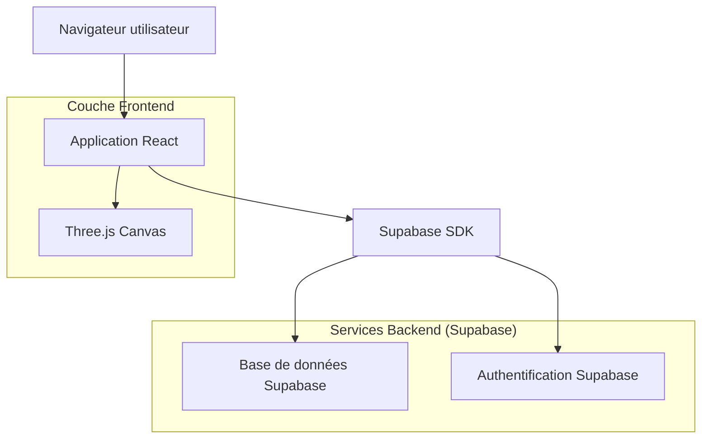
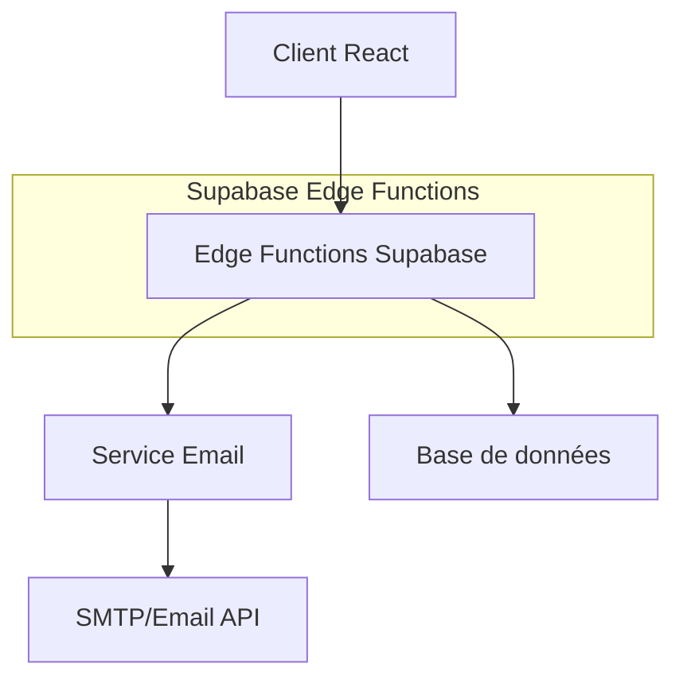
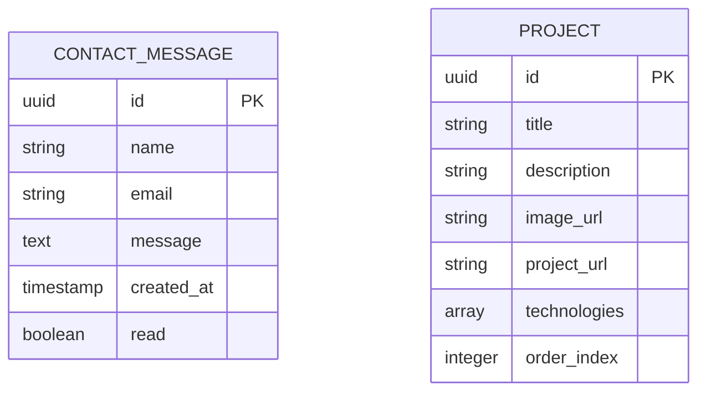

## 1. Architecture technique



## 2. Technologies utilisées

- **Frontend** : React@18 + Vite + Tailwind CSS@3
- **Outil d'initialisation** : vite-init
- **Animations 3D** : Three.js + @react-three/fiber + @react-three/drei
- **Backend** : Supabase (PostgreSQL, Authentication, Edge Functions)
- **Déploiement** : Netlify (CDN + CI/CD)

## 3. Routes de l'application

| Route | Description |
|-------|-------------|
| / | Page d'accueil avec hero section et animation 3D |
| /projets | Galerie des projets réalisés |
| /competences | Liste des compétences techniques |
| /contact | Formulaire de contact |
| /admin | Interface d'administration (protégée) |

## 4. Définitions API

### 4.1 API Contact

```
POST /api/contact
```

Requête :
| Paramètre | Type | Requis | Description |
|-----------|------|---------|-------------|
| name | string | true | Nom du visiteur |
| email | string | true | Email du visiteur |
| message | string | true | Message à transmettre |

Réponse :
| Paramètre | Type | Description |
|-----------|------|-------------|
| success | boolean | Statut de l'envoi |
| message | string | Message de confirmation |

Exemple :
```json
{
  "name": "Jean Dupont",
  "email": "jean@example.com",
  "message": "Bonjour, je suis intéressé par vos services."
}
```

## 5. Architecture serveur



## 6. Modèle de données

### 6.1 Schéma de la base de données



### 6.2 Langage de définition des données

**Table des messages de contact (contact_messages)**
```sql
-- création table
CREATE TABLE contact_messages (
    id UUID PRIMARY KEY DEFAULT gen_random_uuid(),
    name VARCHAR(100) NOT NULL,
    email VARCHAR(255) NOT NULL,
    message TEXT NOT NULL,
    read BOOLEAN DEFAULT FALSE,
    created_at TIMESTAMP WITH TIME ZONE DEFAULT NOW()
);

-- index pour performance
CREATE INDEX idx_contact_messages_created_at ON contact_messages(created_at DESC);
CREATE INDEX idx_contact_messages_read ON contact_messages(read);

-- permissions Supabase
GRANT SELECT ON contact_messages TO anon;
GRANT INSERT ON contact_messages TO anon;
GRANT ALL PRIVILEGES ON contact_messages TO authenticated;
```

**Table des projets (projects)**
```sql
-- création table
CREATE TABLE projects (
    id UUID PRIMARY KEY DEFAULT gen_random_uuid(),
    title VARCHAR(200) NOT NULL,
    description TEXT NOT NULL,
    image_url VARCHAR(500),
    project_url VARCHAR(500),
    technologies TEXT[],
    order_index INTEGER DEFAULT 0,
    created_at TIMESTAMP WITH TIME ZONE DEFAULT NOW()
);

-- données initiales
INSERT INTO projects (title, description, image_url, project_url, technologies, order_index) VALUES
('SYC-75', 'Site vitrine pour SYC-75 avec design moderne et animations fluides', '/images/syc-75-preview.jpg', 'https://syc-75.com', ARRAY['HTML', 'CSS', 'JavaScript'], 1),
('Maison 310', 'Projet immobilier avec interface épurée et expérience utilisateur optimisée', '/images/maison310-preview.jpg', 'https://maison310.netlify.app', ARRAY['React', 'Tailwind CSS'], 2);

-- permissions
GRANT SELECT ON projects TO anon;
GRANT ALL PRIVILEGES ON projects TO authenticated;
```

## 7. Configuration Netlify

**netlify.toml**
```toml
[build]
  command = "npm run build"
  publish = "dist"

[[redirects]]
  from = "/*"
  to = "/index.html"
  status = 200

[build.environment]
  NODE_VERSION = "18"
```

## 8. Optimisations et performance

- **Images** : Optimisation automatique avec Vite, format WebP, lazy loading
- **Bundle size** : Code splitting par routes, tree shaking activé
- **Three.js** : Limite de 50k polygones, utilisation d'instanced mesh pour performance
- **SEO** : SSG pour les pages principales, meta tags dynamiques
- **Accessibilité** : ARIA labels, navigation clavier, contrastes WCAG AA